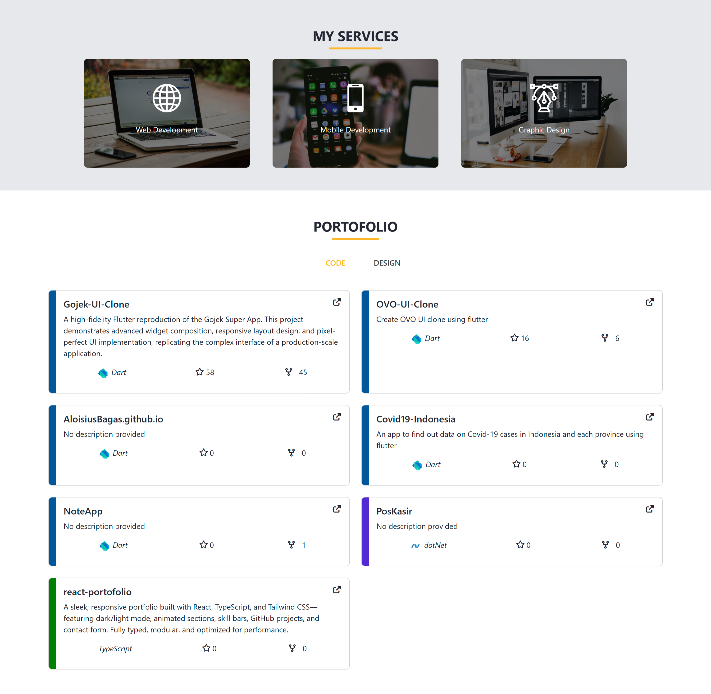
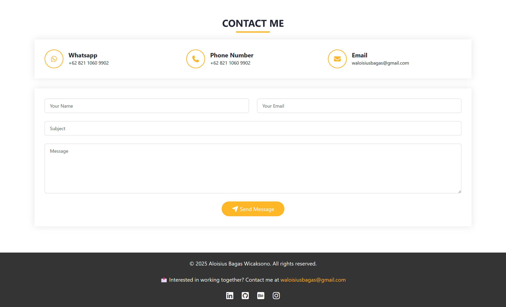

<<<<<<< HEAD
# Vue 3 Portfolio

A modern, responsive personal portfolio website built with **Vue 3** and **TypeScript**. This project showcases a clean design with smooth animations, dark mode support, and a modular architecture.

## 📸 Screenshots

|                     Hero Section                      |                        About Me                         |
| :---------------------------------------------------: | :-----------------------------------------------------: |
|  |  |

|                        Portfolio                         |                         Resume                         |
| :------------------------------------------------------: | :----------------------------------------------------: |
|  |  |

|                        Contact Me                        |     |
| :------------------------------------------------------: | :-: |
|  |     |

## ✨ Features

- **⚡ Vue 3 & Vite**: Blazing fast development and build speeds.
- **🛡️ TypeScript**: Type-safe code for better maintainability.
- **🎨 Dynamic Theming**: Toggle between Dark and Light specific themes.
- **📱 Fully Responsive**: Built with Bootstrap 5 for grid layouts and mobile compatibility.
- **✨ Smooth Animations**: Integrated AOS (Animate On Scroll) for engaging element entrances.
- **🚀 Lazy Loading**: Components are lazy-loaded to optimize initial load time.
- **🧩 Modular Architecture**: Clean file structure with separated components and pages.

## 🛠️ Tech Stack

- **Framework**: [Vue 3](https://vuejs.org/) (Composition API)
- **Build Tool**: [Vite](https://vitejs.dev/)
- **Language**: [TypeScript](https://www.typescriptlang.org/)
- **State Management**: [Pinia](https://pinia.vuejs.org/)
- **Styling**: [Bootstrap 5](https://getbootstrap.com/), CSS3
- **Routing**: [Vue Router 4](https://router.vuejs.org/)
- **Icons**: [Boxicons](https://boxicons.com/), FontAwesome
- **Animations**: [AOS](https://michalsnik.github.io/aos/)

## 🚀 Getting Started

Follow these instructions to get the project up and running on your local machine.

### Prerequisites

- **Node.js**: version 18.0 or higher recommended.
- **npm**: usually comes with Node.js.

### Installation

1.  **Clone the repository**:

    ```sh
    git clone https://github.com/AloisiusBagas/vue-portofolio.git
    cd vue-portofolio
    ```

2.  **Install dependencies**:
    ```sh
    npm install
    ```

### Running the Application

Start the development server with hot-reload:

```sh
npm run dev
```

Open your browser and navigate to `http://localhost:5173` (or the port shown in your terminal).

### Building for Production

Type-check, compile, and minify for production:

```sh
npm run build
```

To preview the production build locally:

```sh
npm run preview
```

### Linting and Formatting

Run the linter to fix coding style issues:

```sh
npm run lint
```

Format code with Prettier:

```sh
npm run format
```

## 🧪 Running Tests

Run unit tests with [Vitest](https://vitest.dev/):

```sh
npm run test:unit
```
=======

# Vue 3 + Vite

This template should help get you started developing with Vue 3 in Vite. The template uses Vue 3 `<script setup>` SFCs, check out the [script setup docs](https://v3.vuejs.org/api/sfc-script-setup.html#sfc-script-setup) to learn more.

Learn more about IDE Support for Vue in the [Vue Docs Scaling up Guide](https://vuejs.org/guide/scaling-up/tooling.html#ide-support).

# portfolio-vue

>>>>>>> 4458e2c4188a1f353ae456e8daffe301cfe9d807
